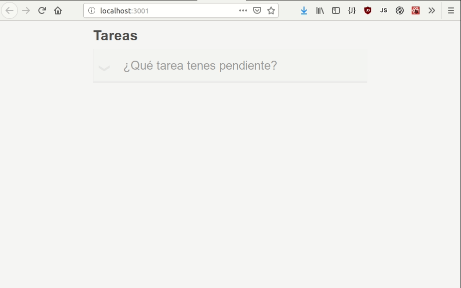

# Redux (para React 16.8)

## Dependencias para el curso
Para comenzar vamos a descargar las cosas necesarias:
- Repositorio de github: [github](https://github.com/FedeG/react-redux-workshop)
- Herramientas para trabajar a lo largo del curso:
  - git (para clonar el repositorio)
  - yarn (para instalar dependencias)
  - vscode plugins
    - eslint
    - jest
    - react

## Ejercicio unico: TODOLIST

## Code sandbox:
- Ejercicio para realizar: [ejercicio](https://codesandbox.io/s/reactredux-ejercicio-6x684)
- Ejercicio terminado: [resultado](https://codesandbox.io/s/reactredux-terminado-me8u2)

## Etapas del curso
- [Guía](redux/README.md)
  - [Links y documentación](https://fedeg.github.io/react-redux-workshop/#/redux/links.md)
  - [Ejemplos](https://es.redux.js.org/docs/introduccion/ejemplos.html)
- [¿Porqué usarlo?](https://fedeg.github.io/react-redux-workshop/#/redux/motivation.md)
- [Principios](https://fedeg.github.io/react-redux-workshop/#/redux/principles.md)
- [Conceptos](https://fedeg.github.io/react-redux-workshop/#/redux/overview.md)
- [Acciones](https://fedeg.github.io/react-redux-workshop/#/redux/actions.md)
- [Reducers](https://fedeg.github.io/react-redux-workshop/#/redux/reducers.md)
- [Store](https://fedeg.github.io/react-redux-workshop/#/redux/store.md)
- [Flujo de datos](https://fedeg.github.io/react-redux-workshop/#/redux/dataflow.md)
- [Uso con React](https://fedeg.github.io/react-redux-workshop/#/redux/react.md)
  - [Store asincrónico en React](https://fedeg.github.io/react-redux-workshop/#/redux/thunk.md)
  - [Store con persistencia en React](https://fedeg.github.io/react-redux-workshop/#/redux/persist.md)